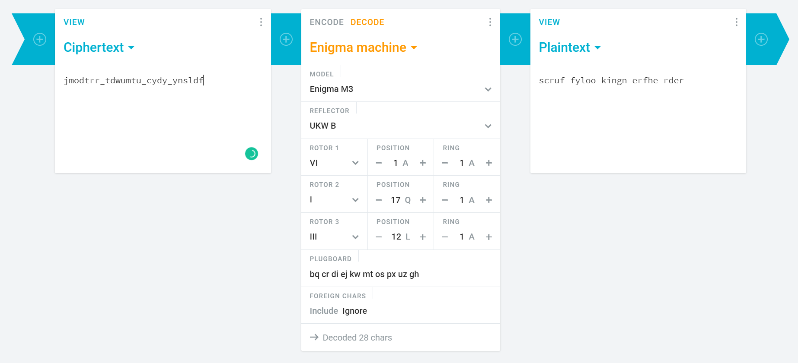

# Turing
```
Recruiting the next Turing. See if you can break this historic cipher! Ciphertext: jmodtrr_tdwumtu_cydy_ynsldf You might need this: M3 UKW B
```

## Challenge
Googling "M3 UKW B" leads me to Engima machine which is indeed a historic cipher device.

I found a link (https://cryptii.com/pipes/enigma-machine) which can decode Engima's encoded text.

<p align="center">
    <kbd></kbd><br/>
</p>

Flag: `flag{scruffy_looking_nerf_herder}`